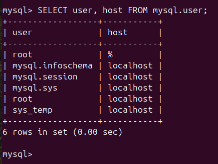
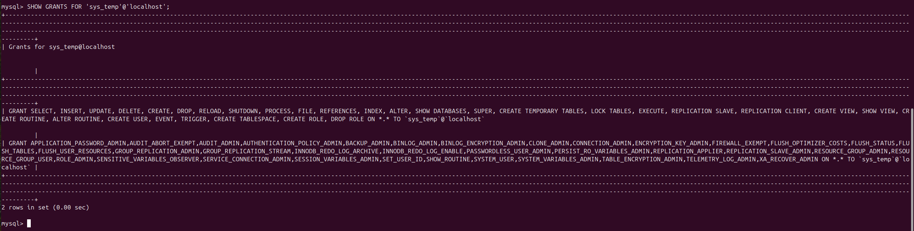
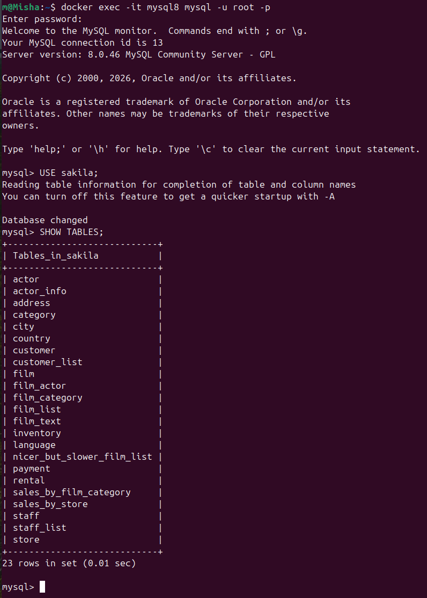
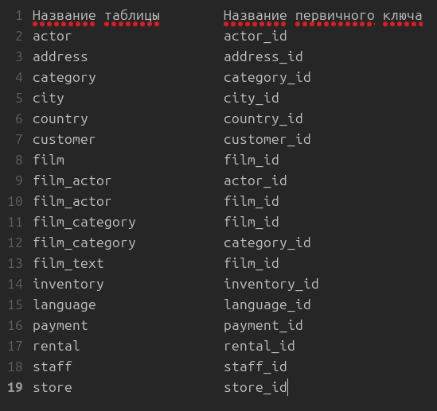

# Домашнее задание к занятию «Работа с данными (DDL/DML)»

**Выполнил:** Чехлов Михаил

## Задание 1. Запрос на получение списка пользователей в базе данных



## 1.1 Запрос на получение списка прав для пользователя sys_temp



## 1.2 Команда для получения всех таблиц базы данных




## Задание 2. Формирование таблицы первичных ключей




## 

**SQL‑запросы:**
```sql
SELECT user, host FROM mysql.user;

-- Создание пользователя
CREATE USER 'sys_temp'@'localhost' IDENTIFIED BY 'temppassword';

-- Предоставление прав
GRANT ALL PRIVILEGES ON *.* TO 'sys_temp'@'localhost';
FLUSH PRIVILEGES;

-- Просмотр прав
SHOW GRANTS FOR 'sys_temp'@'localhost';

-- Выбор базы и показ таблиц
USE sakila;
SHOW TABLES;

-- Запрос на первичные ключи
SELECT
    TABLE_NAME AS 'Название таблицы',
    COLUMN_NAME AS 'Название первичного ключа'
FROM INFORMATION_SCHEMA.KEY_COLUMN_USAGE
WHERE TABLE_SCHEMA = 'sakila'
  AND CONSTRAINT_NAME = 'PRIMARY'
ORDER BY TABLE_NAME;

